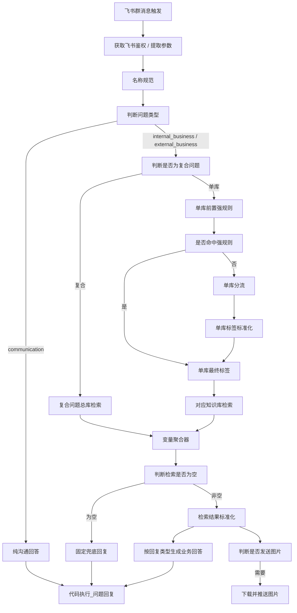

# PRD: Dify 飞书班主任答疑助手工作流

## 1. 文档信息

| 项目 | 内容 |
| --- | --- |
| 文档版本 | v1.1 |
| 文档状态 | 可评审 |
| 编写日期 | 2026-05-25 |
| 产品/工作流 | Dify 飞书班主任答疑助手 |
| 当前工作流基线 | `projects/2026-04-dify-feishu-kb/artifacts/exports/dify-workflow-2026-05-18-six-kb-renamed-routing.yml` |
| 适用范围 | 飞书群内班主任/运营/教务问答，基于 Dify 工作流和知识库检索生成回复 |
| 主要参考 | `details/routing/2026-05-18-dify-workflow-readout.md`、`docs/Decisions.md`、`docs/Cases.md`、`docs/Status.md` |

### 1.1 版本选择说明

本文以 2026-05-18 六知识库重命名后的导出作为最新工作流口径。该版本已移除旧的 `前置分类索引` 依赖，并将 Dify 侧检索标签调整为当前六库显示标签。历史 `(8).yml`、`(10).yml` 仅作为演进参考，不作为本 PRD 的主流程依据。

## 2. 产品概述

### 2.1 产品定位

在飞书群内为班主任、运营和教务人员提供一个可检索、可兜底、可区分内外部口径的答疑助手。用户在群里提出问题后，工作流自动判断问题类型、选择检索范围、调用对应知识库、生成适合场景的回复，并在需要时补充发送图片资料。

### 2.2 一句话目标

让班主任在飞书群里快速获得可信、可转发或可执行的答复，同时避免错库检索、空检索幻觉、内部信息误披露和引用文档不稳定。

### 2.3 核心价值

- 对班主任：减少查资料和组织话术的时间，提升家长沟通稳定性。
- 对运营/教务：把规则、流程、物流、订单判定等内部问题导向正确知识库，减少人工反复解释。
- 对业务质量：通过空检索拦截、metadata 引用、内外部口径区分，降低错误答案和不当披露风险。

## 3. 背景与问题

### 3.1 业务背景

飞书群中的问题主要分为三类：

| 类型 | 示例 | 期望处理 |
| --- | --- | --- |
| 家长可见业务问题 | `退费是否扣教材费？`、`课程是否包含教材？` | 检索知识库，生成可转发给家长的答复 |
| 内部业务问题 | `内部怎么查教材有没有发出？`、`SCRM 已通过是什么意思？` | 检索知识库，生成内部处理建议或核查路径 |
| 纯沟通表达问题 | `孩子坐不住，家长很焦虑，怎么安抚？` | 不检索知识库，直接生成沟通表达建议 |

### 3.2 已确认问题

| 问题 | 影响 |
| --- | --- |
| 路由标签与实际知识库分类不一致 | 可能检索错库、空库，导致回答缺证据 |
| 空检索后仍进入回答模型 | 模型可能基于常识或背景编造答案 |
| 回答模型猜引用文档名 | 引用文档不稳定，难以审计 |
| 复合问题被压到单库 | 可能遗漏规则、物流、系统路径等必要证据 |
| 内外部口径混在同一回答边界里 | 可能把内部流程或字段暴露给家长 |
| 图片资料缺少稳定发送链路 | 用户需要截图/流程图/二维码时无法稳定补图 |

## 4. 用户与场景

### 4.1 目标用户

| 用户角色 | 主要诉求 | 典型问题 |
| --- | --- | --- |
| 班主任 | 快速知道怎么回复家长，或下一步怎么处理 | 课程、教材、退费、物流、学习安排、家长安抚 |
| 运营/教务人员 | 查询规则、流程、系统状态、责任归属 | 审批流、SCRM、判单、转级别、优惠、物流核查 |
| 家长 | 不直接使用工作流，但会接收班主任转发的话术 | 需要清晰、克制、可理解的答复 |

### 4.2 典型使用流程

1. 用户在飞书群提出问题。
2. 工作流接收消息并保留原始问题、群 ID、消息 ID。
3. 工作流判断问题是纯沟通、内部业务还是外部业务。
4. 业务问题进入知识库检索；纯沟通问题直接生成表达建议。
5. 检索结果为空时，工作流输出固定兜底，不让回答模型自由编答。
6. 检索结果有效时，工作流按内外部口径生成回复。
7. 如问题需要图片且检索结果包含图片线索，工作流另行发送匹配图片。

## 5. 产品目标与成功指标

### 5.1 产品目标

| 编号 | 目标 | 说明 |
| --- | --- | --- |
| G1 | 提高路由准确性 | 单一知识域问题进入对应单库；不确定或跨域问题进入复合/总库 |
| G2 | 降低幻觉风险 | 空检索必须在回答模型前被拦截；缺少直接证据时不硬答 |
| G3 | 稳定引用输出 | 引用文档来自检索 metadata 或标准化结果，不由回答模型猜测 |
| G4 | 区分回复对象 | 家长可见答复和内部操作答复使用不同披露边界 |
| G5 | 支持图片资料发送 | 仅在确有图片意图和可用图片元数据时发送匹配图片 |
| G6 | 保持可维护性 | 标签、节点、回归用例、导出版本和人工校验要求可追踪 |

### 5.2 成功指标

| 指标 | 验收口径 |
| --- | --- |
| 工作流可导入 | 当前 YAML 可被 Dify 正常导入 |
| 路由稳定性 | 关键回归用例能输出预期回复类型和检索标签 |
| 空检索安全 | 空检索不进入业务回答模型，不输出伪造引用 |
| 引用稳定性 | 单文档、多文档命中时引用来自 metadata/标准化变量 |
| 口径安全 | 外部回答不暴露内部路径；内部回答能给出可执行建议 |
| 图片准确性 | 图片意图用例能发相关图片，非图片意图用例不误发 |

## 6. 范围定义

### 6.1 本期范围

- 飞书群消息接入、鉴权和回复。
- 问题轻量规范化。
- 回复类型判断：`communication`、`internal_business`、`external_business`。
- 单库/复合检索范围判断。
- 当前六个 Dify 知识库标签下的单库路由。
- 复合问题总库检索。
- 检索结果聚合、空检索拦截、引用文档标准化。
- 家长可见业务回答、内部业务回答、纯沟通回答。
- 基于 `image_refs` 的图片发送判断和飞书图片推送。

### 6.2 非目标

- 不在本工作流内重写所有知识库文档内容。
- 不把所有问题都改成复合检索来追求召回。
- 不用宽泛 query 扩写替代知识库分类修正。
- 不在回答节点里解决所有飞书网络、并发、超时问题。
- 不把本 PRD 当作 Dify 知识库上传规范；上传规范另见 `CleaningBlockRules.md` 和 `CleaningFileOrganizationRules.md`。
- 不在本次 PRD 中迁移本地清洗目录名称。

## 7. 当前知识库口径

Dify 侧使用更适合模型路由理解的显示标签；本地清洗目录暂不重命名。

| 本地清洗目录 | Dify 显示标签 | 核心范围 | 命名考虑 |
| --- | --- | --- | --- |
| 产品介绍与权益 | 产品信息与课程内容 | 产品是什么、课程内容、SKU/价格、包含教材/赠品、适合对象、学习路径、产品 FAQ、产品展示 | 避免“权益”被误解为售后权益或账号权限 |
| 学员交付与班主任FAQ | 学员交付与上课支持 | 上课入口、账号登录、学习安排、班主任服务、级别差异、家长沟通、学习困难 | 弱化 `FAQ` 形态，突出交付和上课支持 |
| 教务规则与制度判定 | 教务规则与制度判定 | 退费、扣费、延期、复课、转班、转级别、跳进度、定级、优惠、转介绍规则 | 保留当前稳定边界 |
| 售后与物流处理 | 售后与物流处理 | 发货、物流状态、快递单号、补发、改地址、拦截、售后执行 SOP | 合并旧 `物流与发货流程` |
| 教学培训与教材解读 | 教学培训与教研资料 | 新课标、教材版本、教材解读、考情政策、知识点、教研培训、竞品分析资料 | 覆盖教研资料，不仅是教材解读 |
| 质检与订单判定规则 | 质检与订单判定规则 | 质检、订单判定、跨部门判单、责任归属、判责材料、二孩优惠判定 | 保留当前稳定边界 |

## 8. 总体方案设计

### 8.1 设计原则

- 最小规范化：只处理高价值别名和状态词，不做大段 query 扩写。
- 单库优先但不强行单库：明确单域问题走单库，不确定和跨域问题走复合。
- 空检索前置拦截：空检索不交给回答模型自由发挥。
- 引用前置标准化：引用文档由 metadata 或标准化变量生成。
- 内外部口径分离：回复类型先分流，避免把内部路径写进家长话术。
- 图片链路旁路化：文本回复先稳定完成，图片发送作为独立分支处理。

### 8.2 主流程

### 8.3 关键策略说明

| 策略 | 采用原因 | 取舍 |
| --- | --- | --- |
| 轻量规范化 | 解决 L0/L1/L2/L3、PU、SCRM 状态词等高价值表达差异 | 不做宽泛扩写，避免正常问题被噪声带偏 |
| 单库白名单、复合兜底 | 错单库会遗漏证据，假复合主要增加噪声和延迟 | 当前更愿意承受假复合 |
| 强规则优先 | 短问题和高置信关键词用代码更稳定 | 只覆盖高置信场景，不穷举长尾 |
| 标签标准化 | Dify 分支依赖精确字符串匹配 | 旧标签只作为兼容输入，不进入产品口径 |
| 空检索拦截 | 空检索后调用回答模型容易幻觉 | 牺牲少量自然表达，换取安全性 |
| metadata 引用 | 模型猜文档名不稳定 | 引用生成前置，提升审计性 |
| 图片独立分支 | 文本回复和图片推送失败面不同 | 图片失败不影响文本回复 |

## 9. 节点设计与设置原因

| 模块 | 节点/能力 | 职责 | 设置原因与考虑 |
| --- | --- | --- | --- |
| 消息接入 | 飞书消息触发 | 接收原始消息、群 ID、消息 ID | 原始消息用于最终语气、文本回复和图片判断，不能被规范化问题替代 |
| 鉴权 | 飞书鉴权、`提取参数` | 获取并解析 `tenant_access_token` | 鉴权不需要语义推理，用代码解析比提取器或 LLM 更稳定 |
| 规范化 | `名称规范` | 对问题做最小必要归一 | 解决别名和状态词检索差异；避免宽泛扩写造成错检索 |
| 回复分流 | `判断问题类型` | 输出 `communication`、`internal_business`、`external_business` | 这是回复类型路由，不承担知识库选择；提前区分内外部披露边界 |
| 检索范围 | `判断是否为复合问题` | 判断单库或复合 | 单库降噪，复合防漏召回；不确定时进入复合更安全 |
| 范围分支 | `单库+复合库分流` | 单库进路由链，复合进总库 | 拆开“是否多库”和“单库是哪库”，降低单节点判断压力 |
| 强规则 | `单库前置强规则` | 高置信问题直接给出 `forced_label` | 质检、退费、物流、APP/入口等边界可编码，规则比 LLM 稳定 |
| 强规则分支 | `是否命中单库强规则` | 命中则跳过 LLM 路由 | 减少不必要模型判断；命中只代表检索节点更确定，不代表可直接回答 |
| LLM 路由 | `单库分流` | 未命中强规则时判断检索节点 | 自然语言表达无法穷举，保留 LLM 处理长尾；允许输出 `复合` |
| 标签收敛 | `单库标签标准化` | 归一为六个新标签或 `复合` | 防止空格、旧标签、简称导致 Dify 条件分支失配 |
| 标签输出 | `单库最终标签` | 生成下游可匹配的最终标签 | 将强规则和 LLM 路径收束到同一变量，便于维护和排查 |
| 检索 | 六个单库检索、`复合问题总库` | 按标签检索知识库 | 单库控制噪声，复合总库控制漏召回；导入后必须人工核对 dataset |
| 聚合 | `变量聚合器` | 合并实际执行的检索结果 | 下游回答链路统一消费，减少重复节点 |
| 安全 | `判断检索是否为空` | 在回答模型前拦截空检索 | 空检索是幻觉高发点，必须固定兜底且不输出引用 |
| 标准化 | `检索结果标准化` | 生成标准正文、引用文档、图片元数据 | 引用和图片线索不交给回答模型临时猜测 |
| 外部回答 | `面向家长的业务相关回复` | 生成家长可见答复 | 控制内部信息披露，保证语气可转发 |
| 内部回答 | `内部业务问题回答` | 生成内部处理建议 | 内部问题需要流程、字段、核查路径，但仍必须受检索证据约束 |
| 沟通回答 | 纯沟通回答节点 | 生成安抚或表达建议 | 不涉及业务事实时不检索，降低延迟和噪声 |
| 回复收口 | `代码执行_问题回复` | 选择最终文本并发送飞书回复 | 统一格式、空值处理、兜底和飞书 HTTP 请求 |
| 图片判断 | `判断是否发送图片` | 判断图片意图并选择图片 | 避免所有文本回答都承担图片下载风险；只在有意图和 metadata 时发图 |
| 图片发送 | 图片下载、迭代与飞书图片推送 | 下载并推送选中图片 | 文本和图片通道隔离，图片失败不应影响文本已发送 |

## 10. 功能需求

### FR1 消息接入与回复

- 系统应从飞书群接收用户消息。
- 系统应保留原始消息、群 ID、消息 ID。
- 系统应支持对同一消息发送文本回复。
- 系统应在必要时支持发送图片回复。

### FR2 问题规范化

- 系统应生成一个规范化问题，用于路由和检索。
- 系统不得把规范化问题当作用户原话直接展示。
- 系统只应规范化高价值别名、级别、课程名、系统状态词等，不做宽泛扩写。

### FR3 回复类型判断

- 系统应将问题分为 `communication`、`internal_business`、`external_business`。
- 纯沟通类问题不应进入知识库检索。
- 涉及课程、产品、金额、退费、教材、物流、权益、资格等业务事实的问题，应进入业务检索链路。
- 涉及 SCRM、后台、审批流、内部核查、字段、提单、备注等问题，应进入内部业务口径。

### FR4 检索范围判断

- 系统应先判断问题属于单库还是复合，再判断具体单库标签。
- 系统应在混合、不明确、拿不准时输出 `复合`。
- 如果多个小问属于同一需求形态，系统可继续输出 `单库`。

### FR5 单库路由

- 系统应优先用强规则处理高置信单库问题。
- 未命中强规则时，系统应调用 LLM 路由器判断检索节点。
- LLM 路由器应允许输出 `复合`，避免不确定时强行选错单库。
- 路由输出必须标准化为当前六个 Dify 显示标签或 `复合`。

### FR6 知识库检索

- 系统应按最终标签进入对应知识库检索节点。
- `复合` 问题应进入 `复合问题总库`。
- Dify 导入后，必须人工核对每个检索节点绑定的真实知识库。
- `质检与订单判定规则` 检索节点需要重点核对，因为导出中复用了旧节点身份和 dataset id。

### FR7 空检索保护

- 聚合后的检索结果为空时，系统不得调用业务回答模型生成自由回答。
- 空检索应输出固定兜底话术。
- 空检索不应输出引用文档行。

### FR8 检索结果标准化

- 系统应从检索结果中提取标准检索正文。
- 系统应从 metadata 或标准化变量中提取引用文档名和引用链接。
- 系统应对引用文档去重。
- 系统应提取图片元数据 `image_refs`，供图片分支判断。

### FR9 业务回答生成

- 外部业务回答应面向家长可读、可转发，不暴露内部路径和后台字段。
- 内部业务回答应面向内部处理，能给出核查路径、流程或处理建议。
- 两类回答都必须基于检索证据。
- 当检索内容不足以直接支持结论时，系统应说明无法确认或引导补充信息，不得编造。

### FR10 图片发送

- 系统应仅在用户问题或回答内容需要图片，且检索结果提供图片元数据时发送图片。
- 系统应根据图片 caption、index、part name、main name、raw name 等文本线索选择图片。
- 系统应限制单次图片数量，避免群内刷屏。
- 图片发送失败不应影响已生成的文本回复。

## 11. 非功能需求

| 类型 | 要求 |
| --- | --- |
| 准确性 | 准确性优先于召回；宁可兜底或复合，不强行单库导致错误结论 |
| 稳定性 | 鉴权、空值、空检索、图片 URL 异常都应有兜底 |
| 可追踪性 | 路由标签、引用文档、图片选择、知识库映射应能从变量或文档追溯 |
| 可维护性 | prompt、代码节点、分支值使用当前六库标签；旧标签只在兼容标准化中出现 |
| 安全性 | 不在家长可见回答中暴露内部字段、后台路径、审批流细节或不该披露的判断过程 |
| 延迟控制 | 纯沟通不检索；强规则命中时跳过 LLM 单库路由；图片分支与文本分支隔离 |

## 12. 验收标准

### 12.1 Done when

- 工作流导出能被 Dify 正常导入。
- 六个检索节点和复合/总库节点的知识库绑定已人工核对。
- `判断问题类型`、`判断是否为复合问题`、`单库分流`、`单库标签标准化` 的输出符合当前六库口径。
- 空检索会在回答模型前被拦截，且不会输出伪造引用文档。
- 引用文档名来自 metadata 或标准化结果，不依赖回答模型猜测。
- 外部回答与内部回答能稳定区分，且不越过各自披露边界。
- 图片发送链路只在需要时触发，且能选到与问题相关的图片。
- `docs/Status.md`、`docs/Decisions.md`、`docs/Review.md` 已写回本次 PRD 结构化调整。

### 12.2 可交付验收项

| 验收项 | 通过标准 |
| --- | --- |
| YAML 导入 | 当前导出文件可被 Dify 正常导入 |
| 节点依赖 | 图中不存在旧 `前置分类索引` 节点依赖 |
| 标签口径 | 路由 prompt 使用当前六个 Dify 显示标签 |
| 旧标签兼容 | 旧标签只保留在 `单库标签标准化` 兼容逻辑中 |
| 检索绑定 | 每个检索节点在 Dify 中绑定到正确知识库 |
| 空检索 | 空检索不会进入业务回答模型 |
| 引用输出 | 单文档、多文档、空检索三类引用输出符合预期 |
| 图片发送 | 图片意图用例能发送相关图片，非图片意图用例不误发 |
| 内外部口径 | 外部回答不暴露内部路径，内部回答能给出可执行建议 |

## 13. 回归用例

| 用例 | 预期结果 |
| --- | --- |
| `L2 和 L3 有什么区别？` | `学员交付与上课支持` |
| `课程是否包含教材？` | `产品信息与课程内容` |
| `教材发了吗？单号是多少？` | `售后与物流处理` |
| `退费是否扣教材费？` | `教务规则与制度判定` |
| `二孩优惠符合条件吗？` | `质检与订单判定规则` |
| `退费要扣教材费吗，教材发货状态在哪里看？` | `复合` |
| `孩子坐不住，家长很焦虑，怎么安抚一下？` | `communication` |
| `内部怎么查教材有没有发出？` | `internal_business` |

## 14. 风险与后续优化

| 风险 | 影响 | 后续处理 |
| --- | --- | --- |
| Dify 导入后 dataset id 不自动对齐 | 检索节点可能绑定错库 | 导入后人工核对所有检索节点，重点核对 `质检与订单判定规则` |
| 复合命中率过高 | 延迟和检索噪声增加 | 基于真实误判补单库白名单，不提前扩写 prompt |
| 聚合结果来源可审计性不足 | 难以排查“为什么用了这个证据” | 后续增加轻量 provenance 字段 |
| 图片发送误发或漏发 | 群内体验和资料准确性受影响 | 用更多真实图片意图样例验证图片分支 |
| 飞书 HTTP 超时/重试未充分验证 | 可能影响消息发送稳定性 | 在真实环境验证超时、重试、失败兜底 |
| 检索到弱相关内容但不支持直接问题 | 仍可能生成不充分答案 | 继续强化回答 prompt 的直接证据约束和回归用例 |

## 15. 版本记录

| 版本 | 日期 | 说明 |
| --- | --- | --- |
| v1.0 | 2026-05-25 | 初版 PRD，覆盖主流程、节点原因、功能需求、验收标准和风险 |
| v1.1 | 2026-05-25 | 按标准 PRD 格式重构，调整为产品概述、背景问题、目标指标、范围、方案设计、功能/非功能需求、验收标准、风险与版本记录 |
